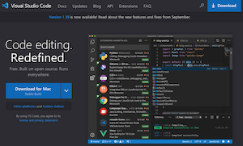

# Introduction

## Hardware


This book is based on the [Raspberry Pi 3 Model B+](https://www.raspberrypi.org/products/raspberry-pi-3-model-b-plus/) hardware and the [GrovePi+ Starter Kit for Raspberry Pi 3](https://www.amazon.com/Seeedstudio-GrovePi-Starter-Kit-Raspberry-Certified/dp/B01BRCEWV2/).  It will work equally well with a [Raspberry Pi 4 Model B](https://www.raspberrypi.org/products/raspberry-pi-4-model-b/).

*Why?*

The Raspberry Pi (RPi) is an inexpensive computer, starting at around $35 US.  If you already have a different computer that you would like to use, feel free to do so, but keep in mind that it may not be compatible with these instructions.  I'm using the RPi3 instead of the 4 because the 4 has some overheating issues that may require the additional purchase and installation of an aftermarket fan.  The 4 also doesn't bring significant improvements that would offset the additional issues.

The GrovePi+ Starter Kit is an inexpensive (if you consider ~$89 US inexpensive) and easy to use set of varied sensors and displays with great support for the RPi.  We'll be using these in our examples.

## Software


The Operating System of choice is [Raspbian Buster Lite image](https://downloads.raspberrypi.org/raspbian_lite_latest) distribution (distro).  It should also work with the older [Stretch image](https://downloads.raspberrypi.org/raspbian_lite/images/raspbian_lite-2019-04-09/2019-04-08-raspbian-stretch-lite.zip) distro as well as [Ubuntu 18.04 LTS preinstalled server image for RPi 3](http://cdimage.ubuntu.com/ubuntu/releases/bionic/release/ubuntu-18.04.3-preinstalled-server-arm64+raspi3.img.xz).

*Why?*

If you only plan to build applications on the RPi and never plan for them to run on any other machine, Raspbian Buster is perfectly capable of handling any task.

If you ever plan to build applications that will run on multiple CPU architectures (Raspberry Pi uses arm-based CPUs, and both Intel and AMD use x86-based CPUs), then Ubuntu is a good choice since it supports both.

## Burning the Software Image


After downloading an image in the previous step, you'll need to transfer it to a microSD card in a way that preserves the filesystem and allows it to be booted.  [Balena's Etcher](https://www.balena.io/etcher/) is a great program for that purpose.  Download and install Etcher, insert your microSD card, then start up Etcher to write the software stack to the card.

*Why?*

The software image is downloaded as a compressed archive, and will require one of several different utilities to uncompress and use.  Etcher removes that need.  Etcher will also partition the filesystem properly on the card so that you don't have to.  Trust me, this is a complicated process and easy to get wrong.  But if you want to tackle it, by all means have fun doing so.

## Connecting to the Raspberry Pi

## Introduction to Docker

Docker is a container runtime engine ... which means that it runs "containerized" applications, or programs.  Containerized applications, or just *containers*, are the smallest and simplest way to package and run one or more programs in an isolated context.  This way of packaging allows you to run programs, along with all of their dependencies, without needing to install the programs on your computer, or even in the same operating system as the one installed on your computer.

Containers are made of one or more images layered on top of each other.  This layering allows you to keep the operating system separated from dependencies separated from the application.  This layering also speeds up the process of building containers, and allows you to re-use images in multiple containers.

Images and containers can be stored in, and downloaded from, registries.  The most popular free registry is DockerHub.

## Basic Docker Commands

We're going to tell Docker to download (if you don't have it) the latest version of the Ubuntu container for your computer's architecture and to connect to it in the `bash` shell as the `root` user.

``` bash
docker run -it ubuntu /bin/bash
```

My computer displayed the following: 

```
Unable to find image 'ubuntu:latest' locally
latest: Pulling from library/ubuntu
22e816666fd6: Pull complete
079b6d2a1e53: Pull complete
11048ebae908: Pull complete
c58094023a2e: Pull complete
Digest: sha256:a7b8b7b33e44b123d7f997bd4d3d0a59fafc63e203d17efedf09ff3f6f516152
Status: Downloaded newer image for ubuntu:latest
root@01970526c47f:/#
```

That last line that ended with the "hash" or "pound" character indicates that you're in the Ubuntu operating system running as the root user.  To show that you're in there, try a few commands like `ls` to list the contents of the folder, then `exit` when you're done.  In this case, exiting will take you out of the Ubuntu container and terminate it.  The Ubuntu image is cached on your computer, so it will not need to be re-downloaded when we run it again.

To see the running docker containers, type `docker ps`.

You should see the column headers, but no information displayed.  Now let's start up the Ubuntu container again, but this time "detached" from your display: `docker run -itd ubuntu`.

The string of characters it prints on the screen will be the container ID.  You can confirm this, and see that it is running, by printing the running docker containers again: `docker ps`.  Notice that the container ID it lists is an abbreviation - or shortened version - of the full container ID.  You can refer to a container by the first few characters of the ID as long as it's unique.

To see just the list of running container IDs, try using the "quiet" flag: `docker ps -q`.

To connect to the running container, use the attach command: `docker attach <ID>` and you will be back in the shell.  Remember to type "exit" to leave the container, which will also stop it.

To see all containers on your computer, no matter whether they are running or in any other state, print them all: `docker ps -a`.

To remove a container from your computer, type `docker rm <ID>`.

And let's put the commands together and tell Docker to remove all containers on your computer:

``` bash
docker rm `docker ps -aq`
```

Last, let's list all of the docker images that have been downloaded: `docker images`.  To see just a list of the image IDs, add the quiet flag: `docker images -q`.  To remove an image, use the remove image command: `docker rmi <ID>`.  And to remove all images, put them together:

``` bash
docker rmi `docker images -q`
```

## Create simple Dockerfile



Choose an editor to create a text file named `Dockerfile`.  I prefer Microsoft's [Visual Studio Code](https://code.visualstudio.com).  You will also want [Docker Desktop](https://www.docker.com/products/docker-desktop) if you plan to build and test on a machine other than the Raspberry Pi.  If you want to save Docker images rather than building them every time, you will want to [create an account with Docker Hub](https://hub.docker.com/signup) and use it as your image repository.

## Build Docker Image

``` bash
docker build ./
```

