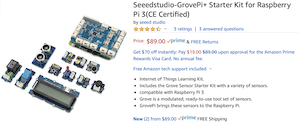

# Introduction

## Hardware



This book is based on the [Raspberry Pi 3 Model B+](https://www.raspberrypi.org/products/raspberry-pi-3-model-b-plus/) hardware and the [GrovePi+ Starter Kit for Raspberry Pi 3](https://www.amazon.com/Seeedstudio-GrovePi-Starter-Kit-Raspberry-Certified/dp/B01BRCEWV2/).  It will work equally well with a [Raspberry Pi 4 Model B](https://www.raspberrypi.org/products/raspberry-pi-4-model-b/).

*Why?*

The Raspberry Pi is an inexpensive computer, starting at around $35 US.  If you already have a different computer that you would like to use, feel free to do so, but keep in mind that it may not be compatible.  I'm using the RPi3 instead of the 4 because the 4 has some overheating issues that may require the additional purchase and installation of an aftermarket fan.  The 4 also doesn't bring significant improvements that would offset the additional issues.

The GrovePi+ Starter Kit is an inexpensive (if you consider ~$89 US inexpensive) set of varied sensors and displays with great support for the Raspberry Pi that is easy to use.

## Software


The software stack of choice is [Raspbian Buster Lite image](https://downloads.raspberrypi.org/raspbian_lite_latest) distribution.  It should also work with the older [Stretch image](https://downloads.raspberrypi.org/raspbian_lite/images/raspbian_lite-2019-04-09/2019-04-08-raspbian-stretch-lite.zip) distro as well as [Ubuntu 18.04 LTS preinstalled server image for RPi 3](http://cdimage.ubuntu.com/ubuntu/releases/bionic/release/ubuntu-18.04.3-preinstalled-server-arm64+raspi3.img.xz).

*Why?*

If you only plan to build applications on the Raspberry Pi and never plan for them to run on any other machine, Raspbian Buster is perfectly capable of handling any task.

If you ever plan to build applications that will run on multiple CPU architectures (Raspberry Pi uses arm-based CPUs, and both Intel and AMD use x86-based CPUs), then Ubuntu is a good choice since it supports both.

## Burning the Software Image


After downloading an image in the previous step, you'll need to transfer it to a microSD card in a way that preserves the filesystem and allows it to be booted.  [Balena's Etcher](https://www.balena.io/etcher/) is a great program for that purpose.  Download and install Etcher, insert your microSD card, then start up Etcher to write the software stack to the card.

*Why?*

The software image is downloaded as a compressed archive, and will require one of several different utilities to uncompress and use.  Etcher removes that need.  Etcher will also partition the filesystem properly on the card so that you don't have to.  Trust me, this is a complicated process and easy to get wrong.  But if you want to tackle it, by all means have fun doing so.

## Connecting to the Raspberry Pi


## Create simple Dockerfile


Choose an editor to create a text file named `Dockerfile`.  I prefer Microsoft's [Visual Studio Code](https://code.visualstudio.com).  You will also want [Docker Desktop](https://www.docker.com/products/docker-desktop) if you plan to build and test on a machine other than the Raspberry Pi.  If you want to save Docker images rather than building them every time, you will want to [create an account with Docker Hub](https://hub.docker.com/signup) and use it as your image repository.

## Build Docker Image

``` bash
docker build ./
```

