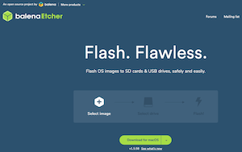

# Introduction - Getting Ready

## Hardware


This book is based on the [Raspberry Pi 3 Model B+](https://www.raspberrypi.org/products/raspberry-pi-3-model-b-plus/) hardware and the [GrovePi+ Starter Kit for Raspberry Pi 3](https://www.amazon.com/Seeedstudio-GrovePi-Starter-Kit-Raspberry-Certified/dp/B01BRCEWV2/).  It will work equally well with a [Raspberry Pi 4 Model B](https://www.raspberrypi.org/products/raspberry-pi-4-model-b/).

*Why?*

The Raspberry Pi (RPi) is an inexpensive computer, starting at around $35 US.  If you already have a different computer that you would like to use, feel free to do so, but keep in mind that it may not be compatible with these instructions.  I'm using the RPi3 instead of the 4 because the 4 has some overheating issues that may require the additional purchase and installation of an aftermarket fan.  The 4 also doesn't bring significant improvements that would offset the additional issues.

The GrovePi+ Starter Kit is an inexpensive (if you consider ~$89 US inexpensive) and easy to use set of varied sensors and displays with great support for the RPi.  We'll be using these in our examples.

## Software


The Operating System of choice is [Raspbian Buster Lite image](https://downloads.raspberrypi.org/raspbian_lite_latest) distribution (distro).  It should also work with the older [Stretch image](https://downloads.raspberrypi.org/raspbian_lite/images/raspbian_lite-2019-04-09/2019-04-08-raspbian-stretch-lite.zip) distro as well as [Ubuntu 18.04 LTS preinstalled server image for RPi 3](http://cdimage.ubuntu.com/ubuntu/releases/bionic/release/ubuntu-18.04.3-preinstalled-server-arm64+raspi3.img.xz).

*Why?*

If you only plan to build applications on the RPi and never plan for them to run on any other machine, Raspbian Buster is perfectly capable of handling any task.

If you ever plan to build applications that will run on multiple CPU architectures (Raspberry Pi uses arm-based CPUs, and both Intel and AMD use x86-based CPUs), then Ubuntu is a good choice since it supports both.

## Burning the Software Image



After downloading an image in the previous step, you'll need to transfer it to a microSD card in a way that preserves the filesystem and allows it to be booted.  [Balena's Etcher](https://www.balena.io/etcher/) is a great program for that purpose.  Download and install Etcher, insert your microSD card, then start up Etcher to write the software stack to the card.

*Why?*

The software image is downloaded as a compressed archive, and will require one of several different utilities to uncompress and use.  Etcher removes that need.  Etcher will also partition the filesystem properly on the card so that you don't have to.  Trust me, this is a complicated process and easy to get wrong.  But if you want to tackle it, by all means have fun doing so.

## Connecting to the Raspberry Pi

### First, Get the RPi's Address

There are several techniques for finding a device on your local network.  You may need to try more than one technique in order to identify the address of your newly-booted RPi.

If you're in a location where you have access to the router that the RPi connects to, try logging onto the router to identify the device and obtain its IP address.  

> Raspberry Pi devices can always be identified by their MAC address, which begins with B8-27-EB for older RPis, and DC-A6-32 for the newer ones.

Another technique that you can use from another device on the network is `arp -a`, but keep in mind that it will only show devices that have actively transmitted on the network recently.

If your network supports mDNS and this is the only RPi on the network, the hostname `raspberrypi.local` will resolve to the IP address of the RPi.  Calling `ping raspberrypi.local` from a terminal will quickly show you the IP address (use ctrl-C to exit the ping).

### Second, Connect to the RPi and Change the Password

Once you have the IP address, using a terminal, type `sss pi@<IP>` where "<IP>" should be replaced with the actual IP address of the RPi.  You will need to type "yes" to continue connecting the first time you access the RPi.  The default password is "raspberry".  Please change the password right away!  You can do that with the command `passwd`.

## Getting Updated

> You have connected to your RPi as the user named "pi".  This user does not have the permission to do everything you will need to do.  The only account that does have unlimited permissions is "root", but you do have the ability to temporarily run commands with elevated permissions using the command `sudo` as a prefix.

Software packages on the RPi can get out-of-date, even if you install the latest version of an operating system.  A package manager is the easiest way to update utilities and programs.  With the Raspbian operating system, that package manager is "apt".

First, you want to tell apt to retrieve the latest list (index) of utilities and programs.  You can do this by calling apt-get with elevated permissions and telling it to update.  The "y" flag is an optional convenience that tells it to automatically answer "yes" to any prompt:

``` bash
sudo apt-get -y update
```

> The first time you run `sudo` in a session, it will ask for the password of the user you are logged in as, "pi".  Any subsequent time it won't.

Once you've updated the index, you will now be able to upgrade any packages that have updates available:

``` bash
sudo apt-get -y upgrade
```

And last, there are a few utilities that will be helpful to have at some point.  If any of these are already installed, the package manager just skips those:

``` bash
sudo apt-get -y install jq git curl make gcc
```

> If at any time it recommends rebooting, you can do so by typing `sudo reboot`, after which you will need to connect to the RPi again after a minute or so.

## Installing Software

In chapter one, you will be using Docker.  You may find it helpful to install both Docker Desktop on your computer, and Docker Community Edition (docker-ce) on the RPi.

To install Docker Desktop on macOS, visit [https://download.docker.com/mac/stable/Docker.dmg](https://download.docker.com/mac/stable/Docker.dmg).

On the RPi, you can install docker-ce the following way:

``` bash
sudo curl -fsSL get.docker.com | sudo sh
```

And then after it is installed, the following command will ensure that your "pi" user can run some docker commands without elevated permissions (after the next reboot):

``` bash
sudo usermod -aG docker pi
```

## Next

On to [chapter one](../CH01 - Docker/README.md).